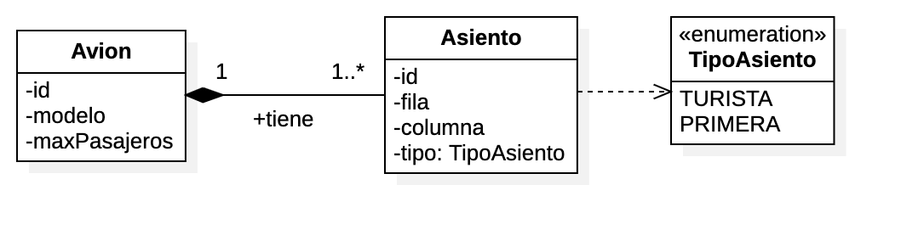

# Ejemplo 10 - Asociación de Composición con Identificador Compuesto

## Asociaciones de composición

Partimos del mismo problema que ya planteamos en el [ejemplo 3](../Composicion/). Sea el siguiente diagrama de clases de UML.



El código fuente que generamos en dicha solución era el siguiente:


```java
@Entity
@Data
@NoArgsConstructor
@AllArgsConstructor
@Builder
public class Asiento {
	
	@Id
	@GeneratedValue
	private Long id;
	
	private int fila, columna;
	
	@Enumerated(EnumType.STRING)
	private TipoAsiento tipo;
	
	@ManyToOne
	private Avion avion;

}
@Entity
@Data
@NoArgsConstructor
@AllArgsConstructor
@Builder
public class Avion {
	
	@Id
	@GeneratedValue
	private Long id;
	
	private String modelo;
	
	private int maxPasajeros;
	
	@ToString.Exclude
	@EqualsAndHashCode.Exclude
	@Builder.Default
	@OneToMany(
			mappedBy="avion", 
			fetch = FetchType.EAGER,
			cascade = CascadeType.ALL,
			orphanRemoval = true
	)
	private List<Asiento> asientos = new ArrayList<>();

	
	// MÉTODOS HELPER
	
	public void addAsiento(Asiento a) {
		a.setAvion(this);
		this.asientos.add(a);
	}
	
	public void removeAsiento(Asiento a) {
		this.asientos.remove(a);
		a.setAvion(null);
		
	}
	
}

```

Sin embargo, nos interesaría que el identificador del `Asiento` fuera compuesto por el identificador del `Avion` más un campo numérico (el número de asiento, vamos). Para ello podemos crear un identificador compuesto. Hacemos uso de `@IdClass` para poder autogenerar el valor del campo numérico.

Vamos a crear entonces una clase con el identificador compuesto, y a reajustar el resto del código para que funcione:

```java
@Data
@NoArgsConstructor
@AllArgsConstructor
public class AsientoPk implements Serializable{
	
	private static final long serialVersionUID = 1L;
	
	
	private Avion avion;
    private Long id;

}


@Entity
@Data
@NoArgsConstructor
@AllArgsConstructor
@Builder
@IdClass(AsientoPk.class)
public class Asiento {
	
	@Id
	@GeneratedValue
	private Long id;
	
	@Id
	@ManyToOne
	private Avion avion;
	
	private int fila, columna;
	
	@Enumerated(EnumType.STRING)
	private TipoAsiento tipo;
	


}

@Entity
@Data
@NoArgsConstructor
@AllArgsConstructor
@Builder
public class Avion {
	
	@Id
	@GeneratedValue
	private Long id;
	
	private String modelo;
	
	private int maxPasajeros;
	
	@ToString.Exclude
	@EqualsAndHashCode.Exclude
	@Builder.Default
	@OneToMany(
			mappedBy="avion", 
			fetch = FetchType.EAGER,
			cascade = CascadeType.ALL,
			orphanRemoval = true
	)
	private List<Asiento> asientos = new ArrayList<>();

	
	// MÉTODOS HELPER
	
	public void addAsiento(Asiento a) {
		a.setAvion(this);
		this.asientos.add(a);
	}
	
	public void removeAsiento(Asiento a) {
		this.asientos.remove(a);
		//a.setAvion(null); // Eliminamos esta línea para evitar otros fallos.
		
	}
	
}

```
